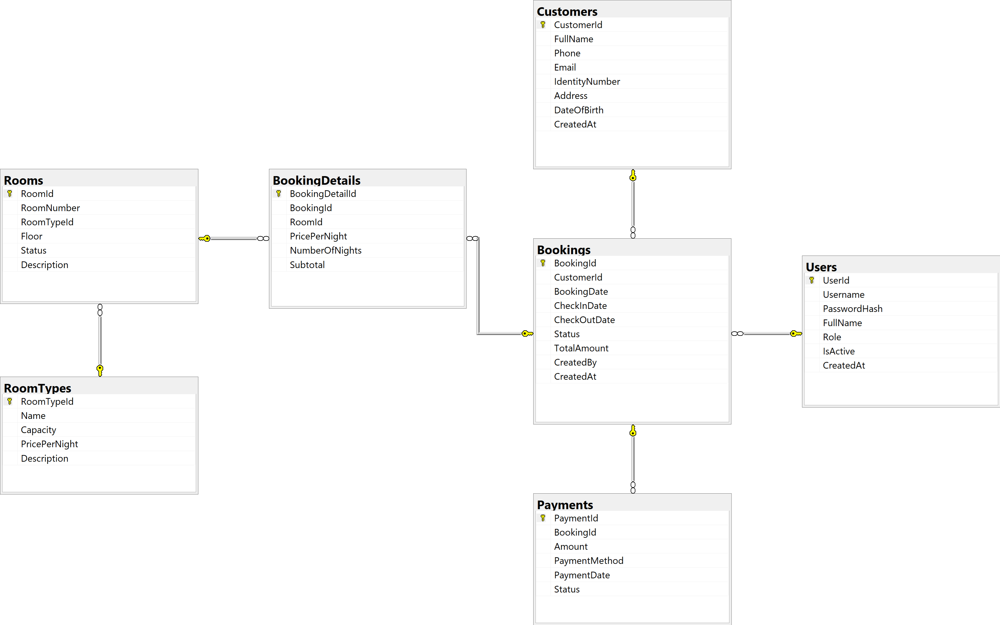

# Hotel & Booking Management System

> **Đồ án cuối kỳ môn học: IT008.R12 - Lập trình hướng đối tượng**  
> **Trường Đại học Công nghệ Thông tin, ĐHQG-TP.HCM (UIT - VNU-HCM)**  
> **Giảng viên hướng dẫn: ThS. Nguyễn Tấn Toàn**

[](https://dotnet.microsoft.com/)
[](https://visualstudio.microsoft.com/)
[](https://www.microsoft.com/sql-server)
[](https://docs.microsoft.com/dotnet/desktop/winforms/)
[](#architecture)

---

## 🌐 Language / Ngôn ngữ
- [Tiếng Việt](#-tiếng-việt)
- [English](#-english)

---

# 🇻🇳 Tiếng Việt

## Overview (Tổng quan)
**Hotel & Booking Management System** là phần mềm quản lý khách sạn và nghiệp vụ đặt phòng dạng ứng dụng máy tính (Desktop Application), được phát triển trên nền tảng **C# Windows Forms** và **Microsoft SQL Server 2022**.

Hệ thống được thiết kế nhằm chuẩn hóa quy trình tiếp đón và quản lý khách sạn, ngăn ngừa triệt để các sai sót thường gặp trong quản lý thủ công như trùng lặp lịch phòng, nhầm lẫn trạng thái buồng phòng, sai sót tính toán chi phí hoặc thất thoát doanh thu.

> **Trạng thái hiện tại:** Dự án đang ở giai đoạn lập kế hoạch và thiết lập nền tảng. Các tính năng, sơ đồ và ảnh giao diện bên dưới là phạm vi/định hướng v1.0; chỉ đánh dấu là hoàn thành khi có mã nguồn, script cơ sở dữ liệu và kiểm thử tương ứng trong repository.

### Chu trình nghiệp vụ chính (Core Operational Flow)
```text
Khách hàng (Customer)
       ↓
Đặt phòng (Booking)
       ↓
Nhận phòng (Check-in)
       ↓
Lưu trú (Stay)
       ↓
Trả phòng (Check-out)
       ↓
Thanh toán & Hóa đơn (Payment / Invoice)
       ↓
Dọn dẹp phòng (Room Cleaning)
       ↓
Phòng sẵn sàng (Available)
```

---

## Features (Tính năng nổi bật)

| Nhóm chức năng | Chi tiết tính năng |
| :--- | :--- |
| **Xác thực & Phân quyền** | Đăng nhập hệ thống, mã hóa mật khẩu, phân chia vai trò người dùng (Manager / Receptionist), khóa/kích hoạt tài khoản. |
| **Quản lý khách hàng** | Thêm mới, chỉnh sửa thông tin khách hàng, tìm kiếm nhanh theo CCCD/Hộ chiếu, Số điện thoại hoặc Họ tên; lưu trữ lịch sử đặt phòng. |
| **Quản lý buồng phòng** | Quản lý danh mục loại phòng (Room Types) và phòng (Rooms); theo dõi trạng thái thời gian thực (`Available`, `Reserved`, `Occupied`, `Cleaning`, `Maintenance`). |
| **Nghiệp vụ Đặt phòng (Booking)** | Tạo đơn đặt phòng mới, chọn phòng trực quan, kiểm tra tự động trùng lịch (overlapping check), quản lý danh sách chi tiết phòng đặt. |
| **Check-in & Check-out** | Tiếp nhận khách nhận phòng, cập nhật trạng thái tức thời, hỗ trợ làm thủ tục trả phòng, tính phụ phí lưu trú hoặc giờ phát sinh. |
| **Thanh toán & Hóa đơn** | Tự động tính toán tổng tiền phòng theo số đêm/giờ, ghi nhận các hình thức thanh toán (Tiền mặt, Chuyển khoản, Thẻ), xuất hóa đơn thanh toán. |
| **Báo cáo & Thống kê** | Bảng điều khiển (Dashboard) trực quan cho Quản lý: Thống kê tỷ lệ lấp đầy phòng, doanh thu theo mốc thời gian, lượt khách lưu trú. |

---

## Technology Stack (Công nghệ sử dụng)

* **Ngôn ngữ lập trình:** C#
* **Nền tảng thực thi:** .NET 10.0.12
* **Giao diện người dùng (GUI):** Windows Forms (WinForms) chuẩn
* **Tầng truy cập dữ liệu (Data Access Layer):** ADO.NET thuần (`Microsoft.Data.SqlClient`)
* **Hệ quản trị cơ sở dữ liệu:** Microsoft SQL Server 2022
* **Môi trường phát triển tích hợp (IDE):** Microsoft Visual Studio 2026

---

## Architecture (Kiến trúc hệ thống)

Dự án tuân thủ nghiêm ngặt mô hình **Kiến trúc phân tầng (Layered Architecture - 3-Tier/N-Tier)** nhằm đảm bảo tính độc lập, khả năng mở rộng và dễ bảo trì mã nguồn:

```text
┌────────────────────────────────────────────────────────┐
│               PRESENTATION LAYER                       │
│  HotelBookingManagement (WinForms UI, Forms, Controls) │
└───────────────────────────┬────────────────────────────┘
                            │
┌───────────────────────────▼────────────────────────────┐
│                BUSINESS LOGIC LAYER                    │
│  HotelBookingManagement.Business                       │
│  (Services, Validation Rules, Interfaces)              │
└───────────────────────────┬────────────────────────────┘
                            │
┌───────────────────────────▼────────────────────────────┐
│                DATA ACCESS LAYER                       │
│  HotelBookingManagement.Data                           │
│  (ADO.NET Repositories, Database Helper, Interfaces)   │
└───────────────────────────┬────────────────────────────┘
                            │
┌───────────────────────────▼────────────────────────────┐
│                   DATABASE ENGINE                      │
│             Microsoft SQL Server 2022                  │
└────────────────────────────────────────────────────────┘
```

> **Shared Domain Layer:** `HotelBookingManagement.Models` chứa các Entity/POCO data model dùng xuyên suốt giữa các tầng (`Customer`, `Room`, `RoomType`, `Booking`, `BookingDetail`, `Payment`, `User`).

---

## Database (Cơ sở dữ liệu)

Cơ sở dữ liệu gồm 7 bảng quan hệ chính được chuẩn hóa:
1. `Users`: Thông tin tài khoản nhân viên, mật khẩu mã hóa, vai trò và trạng thái kích hoạt.
2. `Customers`: Hồ sơ khách hàng lưu trú (Họ tên, SĐT, CCCD/Passport, địa chỉ).
3. `RoomTypes`: Danh mục loại phòng (Standard, Superior, Deluxe, Suite...), sức chứa, đơn giá.
4. `Rooms`: Thông tin từng phòng cụ thể, số phòng, trạng thái hiện tại.
5. `Bookings`: Đơn đặt phòng tổng thể, ngày đặt, ngày nhận/trả dự kiến, trạng thái đơn.
6. `BookingDetails`: Chi tiết các phòng được gán trong một đơn đặt phòng.
7. `Payments`: Thông tin hóa đơn, ngày thanh toán, tổng tiền, phương thức thanh toán.

---

## Project Structure (Cấu trúc thư mục dự án)

```text
HotelBookingManagement/
│
├── HotelBookingManagement.sln               # Solution chính mở bằng Visual Studio
│
├── src/                                     # Mã nguồn dự án
│   │
│   ├── HotelBookingManagement/              # Tầng giao diện người dùng (Presentation)
│   │   ├── Forms/                           # Các màn hình WinForms (Login, Dashboard, ...)
│   │   ├── Controls/                        # User Controls tái sử dụng
│   │   ├── Program.cs                       # Entry point khởi chạy ứng dụng
│   │   └── UI/                              # Tài nguyên, Palette màu, Theme giao diện
│   │
│   ├── HotelBookingManagement.Business/     # Tầng xử lý nghiệp vụ (BLL)
│   │   ├── Services/                        # BookingService, RoomService, CustomerService, ...
│   │   ├── Validators/                      # Kiểm tra tính hợp lệ dữ liệu
│   │   └── Interfaces/                      # Contracts cho tầng Business
│   │
│   ├── HotelBookingManagement.Data/         # Tầng truy xuất dữ liệu (DAL)
│   │   ├── Repositories/                    # CustomerRepository, BookingRepository, ... (ADO.NET)
│   │   ├── Database/                        # DatabaseConnection, DbHelper thực thi truy vấn
│   │   └── Interfaces/                      # Contracts cho Repositories
│   │
│   └── HotelBookingManagement.Models/       # Domain Entities / Data Transfer Models
│       ├── Customer.cs
│       ├── Room.cs
│       ├── RoomType.cs
│       ├── Booking.cs
│       ├── BookingDetail.cs
│       ├── Payment.cs
│       └── User.cs
│
├── database/                                # Script cơ sở dữ liệu SQL Server
│   ├── schema.sql                           # Script DDL khởi tạo bảng, khóa chính, khóa ngoại
│   └── seed.sql                             # Dữ liệu mẫu (Sample/Mock data) phục vụ kiểm thử
│
├── docs/                                    # Tài liệu thiết kế & minh họa
│   ├── Architecture.png                     # Sơ đồ kiến trúc phân tầng
│   ├── ERD.png                              # Sơ đồ thực thể kết hợp cơ sở dữ liệu
│   ├── UseCase.png                          # Sơ đồ ca sử dụng
│   ├── UI/                                  # Ảnh chụp màn hình các chức năng
│   └── Report/                              # Báo cáo đồ án & Slide thuyết trình
│
├── README.md                                # Tài liệu hướng dẫn dự án
├── .gitignore                               # File loại trừ git (bin, obj, cache)
└── LICENSE                                  # Giấy phép mã nguồn mở
```

---

## Requirements (Yêu cầu hệ thống)

Để biên dịch và chạy phần mềm một cách mượt mà nhất, máy tính cần đáp ứng:
* **Hệ điều hành:** Windows 10 (64-bit) / Windows 11.
* **Bộ công cụ phát triển:** Visual Studio 2026 (cài đặt workload *.NET Desktop Development*).
* **Môi trường thực thi (.NET SDK):** .NET 10.0.12 SDK trở lên.
* **Hệ quản trị CSDL:** Microsoft SQL Server 2022 (bản Developer, Enterprise hoặc Express) kèm SQL Server Management Studio (SSMS) hoặc Azure Data Studio.

---

## Installation (Hướng dẫn cài đặt)

1. **Clone repository về máy cục bộ:**
   ```bash
   git clone https://github.com/Btrung-uit/HotelBookingManagerment.git
   cd HotelBookingManagerment
   ```

2. **Cài đặt Cơ sở dữ liệu:** Làm theo hướng dẫn ở mục [Database Setup](#database-setup-cài-đặt-cơ-sở-dữ-liệu).

3. **Cấu hình chuỗi kết nối:** Chỉnh sửa file cấu hình theo mục [Configuration](#configuration-cấu-hình).

4. **Mở dự án:**
   * Mở tệp `HotelBookingManagement.sln` bằng Visual Studio 2026.
   * Chọn cấu hình `Debug` hoặc `Release` với nền tảng `Any CPU`.
   * Nhấn `Build Solution` (phím tắt `Ctrl + Shift + B`) để khôi phục packages và biên dịch.
   * Nhấn `F5` hoặc nút `Start` để khởi chạy phần mềm.

---

## Database Setup (Cài đặt Cơ sở dữ liệu)

1. Khởi động **SQL Server Management Studio (SSMS)** và kết nối tới SQL Server 2022 của bạn.
2. Mở và thực thi tệp script tạo cấu trúc bảng:
   ```sql
   -- Mở và chạy file: database/schema.sql
   ```
   *Script sẽ tự động tạo cơ sở dữ liệu `HotelBookingDB` cùng hệ thống bảng, khóa chính, khóa ngoại và ràng buộc dữ liệu.*
3. Mở và thực thi tệp nạp dữ liệu mẫu ban đầu:
   ```sql
   -- Mở và chạy file: database/seed.sql
   ```
   *Script sẽ nạp danh mục loại phòng, các phòng mẫu, tài khoản quản trị và dữ liệu khách hàng thử nghiệm.*

---

## Configuration (Cấu hình)

Chuỗi kết nối cơ sở dữ liệu được thiết lập trong tệp cấu hình của tầng Presentation (`App.config`). Dự án sử dụng xác thực **Windows Authentication**:

```xml
<?xml version="1.0" encoding="utf-8" ?>
<configuration>
  <connectionStrings>
    <add name="HotelBookingDB"
         connectionString="Server=localhost;Database=HotelBookingDB;Integrated Security=True;TrustServerCertificate=True;"
         providerName="Microsoft.Data.SqlClient" />
  </connectionStrings>
</configuration>
```

> **Lưu ý:** Nếu máy tính của bạn sử dụng SQL Server Instance có tên riêng (ví dụ `localhost\SQLEXPRESS`), hãy đổi `Server=localhost` thành `Server=localhost\SQLEXPRESS`.

---

## Demo Account (Tài khoản Demo)

Hệ thống được nạp sẵn 2 tài khoản mẫu trong tệp `seed.sql` với các quyền hạn tương ứng:

| Tài khoản | Tên đăng nhập | Mật khẩu | Quyền hạn (Role) | Mô tả phạm vi quyền |
| :--- | :--- | :--- | :--- | :--- |
| **Quản lý (Manager)** | `admin` | `Admin@123` | `Manager` | Toàn quyền: Xem Dashboard, doanh thu, quản lý danh mục phòng, giá và nhân viên. |
| **Tiếp tân (Receptionist)** | `receptionist` | `Reception@123` | `Receptionist` | Nghiệp vụ thường nhật: Tiếp nhận khách, đặt phòng, check-in, check-out, lập hóa đơn. |

---

## Screenshots (Ảnh chụp giao diện & Sơ đồ)

### Sơ đồ kiến trúc & Thiết kế
| Sơ đồ phân tầng (Architecture) | Sơ đồ cơ sở dữ liệu (ERD) |
| :---: | :---: |
|  |  |

| Sơ đồ ca sử dụng (Use Case) |
| :---: |
|  |

### Giao diện người dùng
| Đăng nhập hệ thống (Login) | Bảng điều khiển (Dashboard) |
| :---: | :---: |
|  |  |

| Quản lý buồng phòng (Rooms) | Quy trình Đặt phòng (Booking Workflow) |
| :---: | :---: |
|  |  |

| Quản lý khách hàng (Customers) | Thanh toán & Hóa đơn (Payment) |
| :---: | :---: |
|  |  |

---

## Team Members (Thành viên nhóm)

Dự án được thực hiện bởi nhóm sinh viên **IT008.R12 - Lập trình hướng đối tượng**:

| STT | Họ và Tên | Mã số sinh viên (MSSV) | Vai trò | Trách nhiệm chính |
| :---: | :--- | :---: | :---: | :--- |
| 1 | **Nguyễn Đức Bảo Trung** | **25521963** | **TV01 — Leader** | Foundation, GitHub/PR review, authentication, integration, release. |
| 2 | **Lê Gia Bảo** | **25520132** | **TV02** | Customer, Room/RoomType, shared model/repository contract, room statistics. |
| 3 | **Nguyễn Thành Phát** | **25521372** | **TV03** | Booking, Check-in/Check-out, service contract, booking statistics. |
| 4 | **Lê Anh Duy** | **23520365** | **TV04** | Payment/Invoice, UI system, dashboard/report, screenshots, documentation and slides. |

---

## GitHub Workflow (Quy trình làm việc nhóm)

### Mô hình nhánh (Branching Strategy)
* `main`: Bản ổn định/release. Mọi thay đổi đi qua Pull Request.
* `develop`: Nhánh tích hợp cho feature đã được review.
* Branch hiện có: `feature/foundation`, `feature/auth`, `feature/customer`, `feature/room`, `feature/booking`, `feature/checkin`, `feature/payment`, `feature/dashboard`, `feature/ui-system`.
* `feature/<task-name>`: Ưu tiên branch ngắn theo task/PR; không giữ một branch dở dang quá lâu.
* `docs/<topic>`: Tài liệu, README, report hoặc slide; chỉ tạo khi cần.
* `bugfix/<issue-name>`: Sửa lỗi phát sinh.

Quy trình chuẩn: `feature/* → Pull Request → develop`. Khi `develop` đã ổn định và qua kiểm thử tích hợp: `develop → Pull Request → main`. Riêng tài liệu nền tảng có thể tạo PR trực tiếp vào `main` khi chưa ảnh hưởng đến code phát hành.

### Quy chuẩn đặt tên Commit (Commit Convention)
Tuân theo chuẩn **Conventional Commits**:
* `feat:` Bổ sung tính năng mới (ví dụ: `feat: implement booking overlap validation`)
* `fix:` Sửa lỗi (ví dụ: `fix: correct room price calculation on late checkout`)
* `refactor:` Tái cấu trúc mã nguồn nhưng không đổi tính năng (ví dụ: `refactor: extract db connection to helper`)
* `docs:` Cập nhật tài liệu (ví dụ: `docs: update setup instructions in readme`)
* `chore:` Công việc linh tinh, cập nhật config, gitignore...

---
---

# 🇬🇧 English

## Overview
**Hotel & Booking Management System** is a robust desktop application built on **C# Windows Forms** and **Microsoft SQL Server 2022**.

The application is engineered to streamline front desk operations, room inventory tracking, and payment processing, mitigating recurring issues in traditional management such as double-booking, status desynchronization, invoicing discrepancies, and revenue leakage.

> **Current status:** The project is in planning and foundation setup. The features, diagrams, and UI screenshots below describe the v1.0 scope; they are complete only when corresponding source code, database scripts, and tests exist in the repository.

### Core Operational Lifecycle
```text
Customer
   ↓
Booking
   ↓
Check-in
   ↓
Stay
   ↓
Check-out
   ↓
Payment / Invoice
   ↓
Room Cleaning
   ↓
Available
```

---

## Features

| Feature Module | Description |
| :--- | :--- |
| **Authentication & RBAC** | Secure user login, credential hashing, Role-Based Access Control (`Manager` / `Receptionist`), account activation toggle. |
| **Customer Management** | Create and maintain guest profiles, fast lookup via National ID / Passport, Phone, or Name; historical booking logs. |
| **Room & Inventory Control** | Categorize room types, maintain room directories, and track real-time statuses (`Available`, `Reserved`, `Occupied`, `Cleaning`, `Maintenance`). |
| **Booking Engine** | Interactive reservation flow, room picker, automatic overlap prevention algorithms, multi-room booking capability. |
| **Check-in & Check-out** | Streamlined guest arrival processing, instant status synchronization, late checkout fee calculation. |
| **Billing & Invoicing** | Automated nightly rate aggregation, multi-payment support (Cash, Bank Transfer, Credit Card), printable invoice generation. |
| **Analytics & Reporting** | Executive dashboard displaying occupancy metrics, real-time status breakdowns, and periodic revenue reports. |

---

## Technology Stack

* **Programming Language:** C#
* **Framework Runtime:** .NET 10.0.12
* **Graphical Interface:** Standard Windows Forms (WinForms)
* **Data Access Layer:** Pure ADO.NET (`Microsoft.Data.SqlClient`)
* **Relational Database:** Microsoft SQL Server 2022
* **IDE:** Microsoft Visual Studio 2026

---

## Architecture

The project strictly follows the **3-Tier / Layered Architecture** paradigm to isolate concerns and guarantee maintainability:

```text
┌────────────────────────────────────────────────────────┐
│               PRESENTATION LAYER                       │
│  HotelBookingManagement (WinForms UI, Forms, Controls) │
└───────────────────────────┬────────────────────────────┘
                            │
┌───────────────────────────▼────────────────────────────┐
│                BUSINESS LOGIC LAYER                    │
│  HotelBookingManagement.Business                       │
│  (Services, Validation Rules, Interfaces)              │
└───────────────────────────┬────────────────────────────┘
                            │
┌───────────────────────────▼────────────────────────────┐
│                DATA ACCESS LAYER                       │
│  HotelBookingManagement.Data                           │
│  (ADO.NET Repositories, Database Helper, Interfaces)   │
└───────────────────────────┬────────────────────────────┘
                            │
┌───────────────────────────▼────────────────────────────┐
│                   DATABASE ENGINE                      │
│             Microsoft SQL Server 2022                  │
└────────────────────────────────────────────────────────┘
```

> **Shared Domain Layer:** `HotelBookingManagement.Models` houses POCO domain entities shared across all layers (`Customer`, `Room`, `RoomType`, `Booking`, `BookingDetail`, `Payment`, `User`).

---

## Database

The database consists of 7 normalized relational tables:
1. `Users`: System operator accounts, hashed credentials, roles, and status flags.
2. `Customers`: Guest identification, contact info, and registration logs.
3. `RoomTypes`: Room classes (Standard, Superior, Deluxe, Suite), standard capacities, base nightly rates.
4. `Rooms`: Physical room numbers, assigned types, and current state.
5. `Bookings`: Master booking records with schedules and progress status.
6. `BookingDetails`: Association mappings linking rooms to a specific reservation.
7. `Payments`: Billing records, timestamps, amount paid, and payment methods.

---

## Project Structure

```text
HotelBookingManagement/
│
├── HotelBookingManagement.sln               # Primary solution file for Visual Studio
│
├── src/                                     # Source code root
│   │
│   ├── HotelBookingManagement/              # Presentation layer (WinForms)
│   │   ├── Forms/                           # Windows Forms UI views
│   │   ├── Controls/                        # Reusable custom controls
│   │   ├── Program.cs                       # Application entry point
│   │   └── UI/                              # Theme palettes and UI helpers
│   │
│   ├── HotelBookingManagement.Business/     # Business logic layer (BLL)
│   │   ├── Services/                        # Business workflows & orchestrators
│   │   ├── Validators/                      # Domain validation rules
│   │   └── Interfaces/                      # BLL abstraction contracts
│   │
│   ├── HotelBookingManagement.Data/         # Data access layer (DAL)
│   │   ├── Repositories/                    # Pure ADO.NET CRUD repositories
│   │   ├── Database/                        # DatabaseConnection & DbHelper
│   │   └── Interfaces/                      # DAL abstraction contracts
│   │
│   └── HotelBookingManagement.Models/       # Domain POCO Models
│       ├── Customer.cs
│       ├── Room.cs
│       ├── RoomType.cs
│       ├── Booking.cs
│       ├── BookingDetail.cs
│       ├── Payment.cs
│       └── User.cs
│
├── database/                                # Database scripts
│   ├── schema.sql                           # DDL schema definition script
│   └── seed.sql                             # DML test fixture and seed dataset
│
├── docs/                                    # Documentation and diagrams
│   ├── Architecture.png                     # System architecture diagram
│   ├── ERD.png                              # Entity-Relationship diagram
│   ├── UseCase.png                          # Use case overview diagram
│   ├── UI/                                  # UI screenshot captures
│   └── Report/                              # Course reports and presentation slides
│
├── README.md                                # Project documentation guide
├── .gitignore                               # Git ignore definitions
└── LICENSE                                  # Open-source license
```

---

## Requirements

Ensure your workstation meets the following prerequisites before building:
* **Operating System:** Windows 10 (64-bit) / Windows 11.
* **IDE:** Microsoft Visual Studio 2026 with *.NET Desktop Development* workload.
* **SDK:** .NET 10.0.12 SDK or newer.
* **Database Server:** Microsoft SQL Server 2022 (Developer / Express / Enterprise) with SSMS.

---

## Installation

1. **Clone the repository:**
   ```bash
   git clone https://github.com/Btrung-uit/HotelBookingManagerment.git
   cd HotelBookingManagerment
   ```

2. **Execute Database Scripts:** Refer to [Database Setup](#database-setup).

3. **Configure Connection String:** Modify configuration as outlined in [Configuration](#configuration).

4. **Build and Run:**
   * Open `HotelBookingManagement.sln` in Visual Studio 2026.
   * Restore NuGet packages and select `Debug | Any CPU`.
   * Press `Ctrl + Shift + B` to build the solution.
   * Press `F5` to execute the application.

---

## Database Setup

1. Launch **SQL Server Management Studio (SSMS)** and connect to your SQL Server 2022 instance.
2. Open and execute the table schema creation script:
   ```sql
   -- Execute file: database/schema.sql
   ```
   *This script provisions the `HotelBookingDB` database, tables, primary/foreign keys, and constraint checks.*
3. Open and execute the mock data script:
   ```sql
   -- Execute file: database/seed.sql
   ```
   *This populates initial room classifications, demo rooms, operator accounts, and sample guests.*

---

## Configuration

Update the connection string inside `App.config` within the Presentation project. The default setup targets **Windows Authentication**:

```xml
<?xml version="1.0" encoding="utf-8" ?>
<configuration>
  <connectionStrings>
    <add name="HotelBookingDB"
         connectionString="Server=localhost;Database=HotelBookingDB;Integrated Security=True;TrustServerCertificate=True;"
         providerName="Microsoft.Data.SqlClient" />
  </connectionStrings>
</configuration>
```

> **Note:** If your SQL Server instance is named (e.g., `localhost\SQLEXPRESS`), update `Server=localhost` to match your local instance name.

---

## Demo Account

The seed data provisions two default testing accounts:

| Account Type | Username | Password | Role | Privileges |
| :--- | :--- | :--- | :--- | :--- |
| **Manager (Admin)** | `admin` | `Admin@123` | `Manager` | Full control: Dashboards, room & rate configurations, staff management. |
| **Receptionist** | `receptionist` | `Reception@123` | `Receptionist` | Operational access: Room checks, reservations, check-in/out, and invoicing. |

---

## Screenshots

### Technical Diagrams
| Architecture Diagram | Entity-Relationship Diagram (ERD) |
| :---: | :---: |
|  |  |

| Use Case Diagram |
| :---: |
|  |

### User Interface Views
| Authentication (Login) | Management Dashboard |
| :---: | :---: |
|  |  |

| Room Inventory Control | Booking Workflow |
| :---: | :---: |
|  |  |

| Guest Directory | Invoicing & Checkout |
| :---: | :---: |
|  |  |

---

## Team Members

Developed by students of course **IT008.R12 - Lập trình hướng đối tượng**:

| # | Full Name | Student ID (MSSV) | Role | Primary Responsibilities |
| :---: | :--- | :---: | :---: | :--- |
| 1 | **Nguyễn Đức Bảo Trung** | **25521963** | **TV01 — Leader** | Foundation, GitHub/PR review, authentication, integration, release. |
| 2 | **Lê Gia Bảo** | **25520132** | **TV02** | Customer, Room/RoomType, shared model/repository contract, room statistics. |
| 3 | **Nguyễn Thành Phát** | **25521372** | **TV03** | Booking, check-in/check-out, service contract, booking statistics. |
| 4 | **Lê Anh Duy** | **23520365** | **TV04** | Payment/invoice, UI system, dashboard/report, screenshots, documentation, and slides. |

---

## GitHub Workflow

### Branching Model
* `main`: Stable release branch. Every change is merged through a pull request.
* `develop`: Integration branch for reviewed features.
* Existing branches: `feature/foundation`, `feature/auth`, `feature/customer`, `feature/room`, `feature/booking`, `feature/checkin`, `feature/payment`, `feature/dashboard`, and `feature/ui-system`.
* `feature/<task-name>`: Prefer short-lived task/PR branches.
* `docs/<topic>`: Documentation, report, or slide work when needed.
* `bugfix/<name>`: Isolated bug fixes.

Standard flow: `feature/* → Pull Request → develop`; after integration testing, `develop → Pull Request → main`.

### Commit Conventions
Following the standard **Conventional Commits**:
* `feat:` Introducing new functionality
* `fix:` Resolving a defect or unexpected behavior
* `refactor:` Code refactoring without altering behavioral outcome
* `docs:` Modifying documentation
* `chore:` Build tooling, configuration, or housekeeping adjustments
